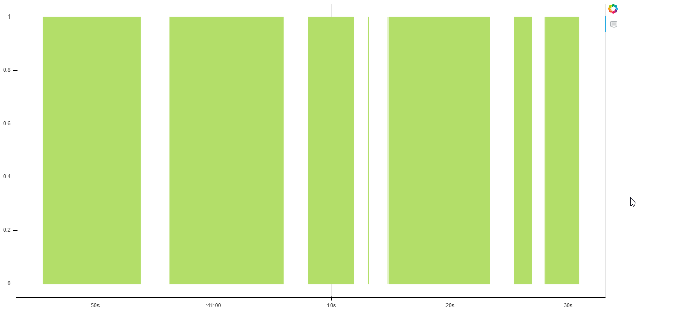
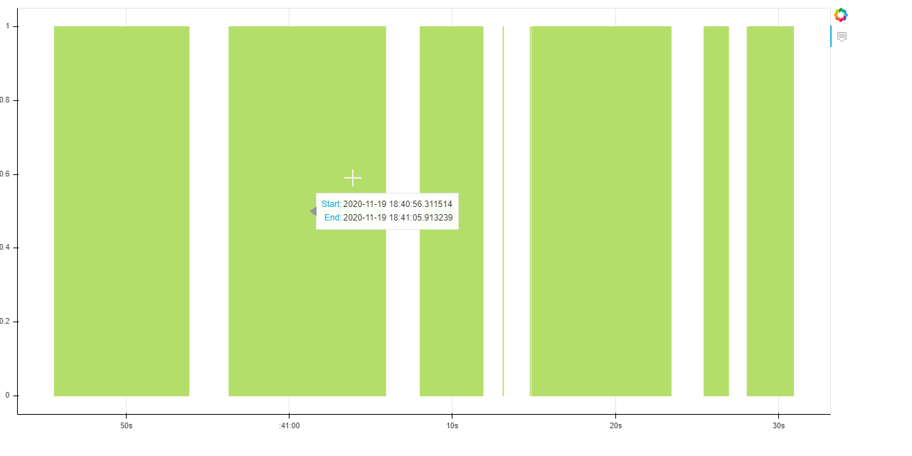

# WebCam motion detector system
---------------------------------

* Tools Used : 

---------------------------------

a. OpenCV b. bokeh c. pandas

---------------------------------

* Approach :

---------------------------------

a. OpenCV has been used for capturing frames from webcam. When user presses 'q', a csv file is generated automatically which contains the start and end times of the object in the frame. 
"app.py" file basically performing that detection and recording portion.

b. bokeh is a data visualization tool in python. It has been used for bar representation of the times.
c. pandas has been used for csv reading purpose and after some modifications on data, it generates a dataframe which is used by bokeh to perform it's task.
"time_series.ipynb" notebook is for reading the csv file and generating the html file("plotting.html" - which shows the bar representation) using bokeh and pandas.

----------------------------------

* Screenshots

----------------------------------
### Detecting object and recording start-end times.

### Bar representation of the times

